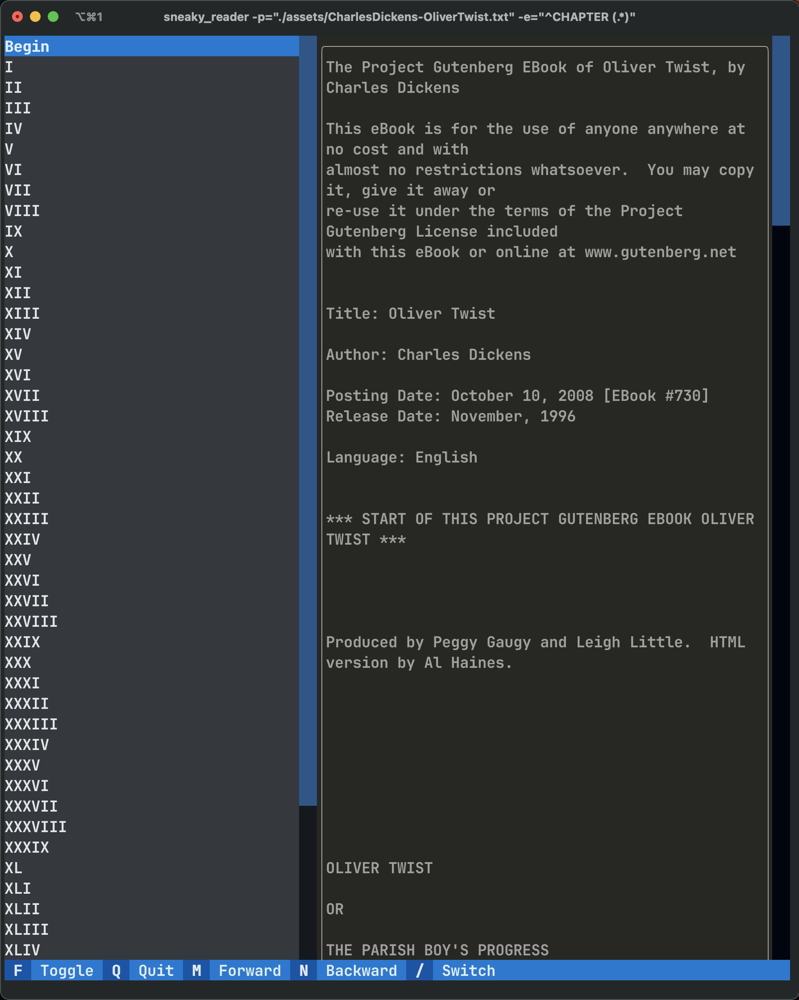
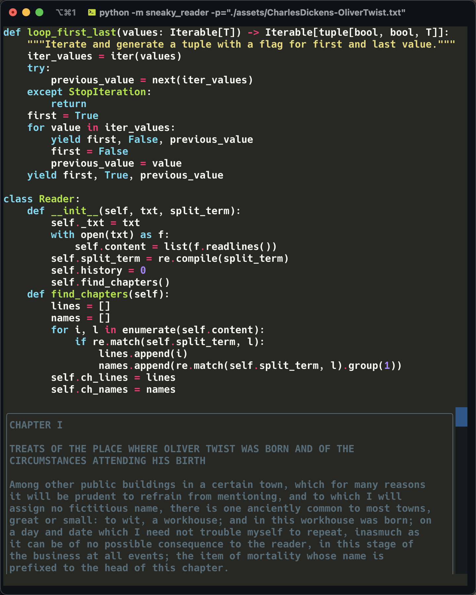
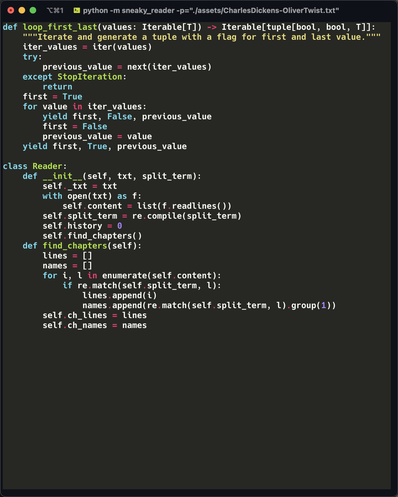

<div align="center">
  <h1>Sneaky-Reader 🤫</h1>
  <p><strong>Hide your book under a fancy terminal</strong></p>
  <p><strong>上班摸鱼的幻影坦克</strong></p>
</div>


  <div class="row" align="center">
      
      
      
  </div>


## Features

### Smart spliting

Sneaky-reader supports you to use regluar expression (refer to the `re` module in python) to split your TXT into chapters. Using the command line option `-e` to pass your regluar expression. 

Remember, always group your chapter name in first in your regular expression! *group the title with `()`*

### Intuitive usage

Greate thanks to the wonderful projects: [`rich`](https://github.com/Textualize/rich) and [`textual`](https://github.com/Textualize/textual), sneaky-reader can build a (relatively) complex UI in terminal with few lines:

* You can press `f` to show/hide the chapters pane
* You can press `m`, `n` to forward/backward the current chapter
* You can press `s` to enable BOSS mode! It will hide all the sneaky things and only leave a fake Python snippet.

### History saving

Sneaky-reader implements a simple cache. It will create a `.pkl` file right beside your TXT book. The next time you open the same book, Sneaky-reader will point to the last reading position.

## Quick Start

Clone this repo, then install `textual` with `pip install -r requirements.txt`.

For the demo books, you could start with commands
```/shell
#demo in english
python -m sneaky_reader -p="./assets/CharlesDickens-OliverTwist.txt" -e="^CHAPTER (.*)"

# demo in chinese
python -m sneaky_reader -p="./assets/红楼梦.txt" -e="^第(.*)回"
```
