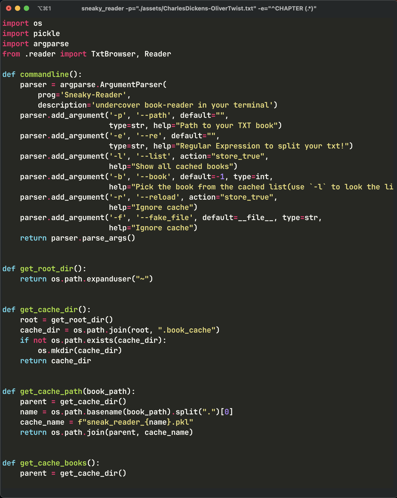

<div align="center">
  <h1>Sneaky-Reader 🤫</h1>
  <p><strong>Hide your book under a fancy terminal</strong></p>
  <p><strong>上班看书的幻影坦克</strong></p>
</div>


<div align="center">
  <div class="row" align="center">
      
      
      
  </div>
  <a align="center"> Find dickens in those images</a>
</div>


## Features
### History saving

Sneaky-reader implements a simple cache. You can use `-l` to list all the previous books, and use `-b ID` to quickly get the book. For example:
```
$ sneaky_reader -l
[0] CharlesDickens-OliverTwist
[1] 红楼梦
$ sneaky_reader -b0
...
```
### Intuitive usage

Greate thanks to the wonderful projects: [`rich`](https://github.com/Textualize/rich) and [`textual`](https://github.com/Textualize/textual), sneaky-reader can build a (relatively) complex UI in terminal with few lines:

* You can press `f` to show/hide the chapters pane
* You can press `m`, `n` to forward/backward the current chapter
* You can press `/` to enable BOSS mode! It will hide all the sneaky things and only leave a fake Python snippet.

### Smart spliting

Sneaky-reader supports you to use regluar expression (refer to the `re` module in python) to split your TXT into chapters. Using the command line option `-e` to pass your regluar expression. 

Remember, always group your chapter name in first in your regular expression! *group the title with `()`*
## Quick Start

Clone and enter this repo, then install with `pip install -e .`. Then you have a shell command `sneaky_reader` to use!

For the demo books, you could start with commands
```/shell
#demo in english
sneaky_reader -p="./assets/CharlesDickens-OliverTwist.txt" -e="^CHAPTER (.*)"

# demo in chinese
sneaky_reader -p="./assets/红楼梦.txt" -e="^第(.*)回"
```
For the first time you import a book, `sneaky_reader` will require the book path and the spliting expression. After that, the book will be cached and you can read it with command `-b ID`.
